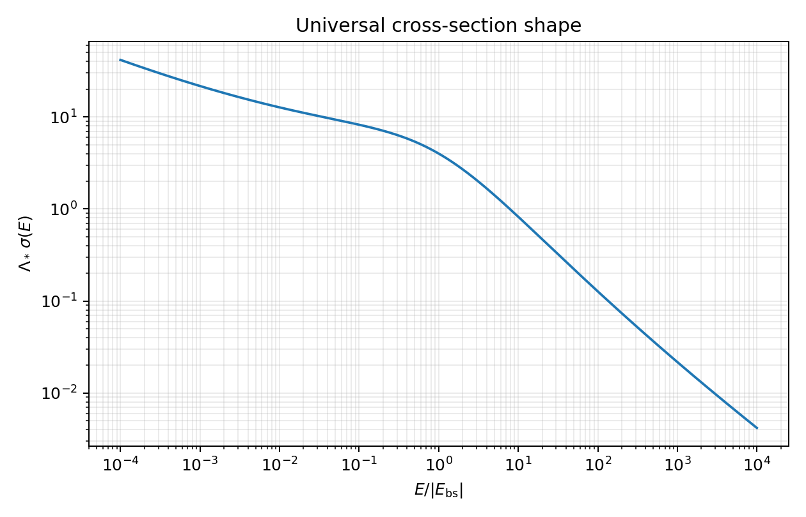

::: {.callout-important title="How to use this packet"}
This is not an introductory reading. It is a guided derivation for a student who already knows the time-independent Schrödinger equation and is comfortable learning new mathematical tools as needed.

Do not read this passively. The problems are the packet. Keep a scratch notebook open. When a special-function identity is supplied, treat it as a tool, not as a fact to memorize.
:::

The goal is to see, inside a solvable quantum-mechanical problem, the same conceptual pattern that appears in quantum field theory:

1. a classically scale-invariant model,
2. an ultraviolet divergence after quantization,
3. a regulator,
4. a cutoff-dependent bare coupling,
5. a finite physical observable,
6. a running renormalized coupling,
7. a beta function,
8. a dynamically generated scale,
9. asymptotic freedom,
10. a scale anomaly.

The model is a nonrelativistic particle moving in two spatial dimensions in the attractive potential of a point source:

$$
V(\mathbf{x})=-\lambda\delta^{(2)}(\mathbf{x}),
\qquad \lambda>0.
$$

The attractive delta-function potential in one spatial dimension is familiar and well behaved. In two spatial dimensions it is more subtle: the corresponding quantum problem is ultraviolet divergent and must be renormalized.

Throughout, the mass of the moving particle is $M$, the wave function is $\psi(\mathbf{x})$, and the time-independent Schrödinger equation is

$$
-\frac{\hbar^2}{2M}\nabla^2\psi(\mathbf{x})+V(\mathbf{x})\psi(\mathbf{x})=E\psi(\mathbf{x}).
$$

Useful external references:

- [Bessel functions](https://en.wikipedia.org/wiki/Bessel_function), especially the roles of $J_0$, $K_0$, and Hankel functions.
- [Green's function](https://en.wikipedia.org/wiki/Green%27s_function), for the general idea of inverting a differential operator with a point-source response.
- [Lippmann--Schwinger equation](https://en.wikipedia.org/wiki/Lippmann%E2%80%93Schwinger_equation), for the scattering integral equation used later.
- [Cross section](https://en.wikipedia.org/wiki/Cross_section_(physics)), for the vocabulary of scattering measurements.
- [Beta function](https://en.wikipedia.org/wiki/Beta_function_(physics)), [asymptotic freedom](https://en.wikipedia.org/wiki/Asymptotic_freedom), and [dimensional transmutation](https://en.wikipedia.org/wiki/Dimensional_transmutation), for the QFT language that this toy model is designed to illuminate.

## Mathematical interlude: why Bessel functions appear

The unfamiliar special functions in this packet are not arbitrary decorations. They appear for the same reason that sines, cosines, and exponentials appear in one-dimensional constant-coefficient differential equations.

In one spatial dimension, the free equation

$$
\frac{d^2f}{dx^2}+k^2f=0
$$

has oscillatory solutions such as $\cos(kx)$, $\sin(kx)$, and $e^{\pm ikx}$. If the sign is changed,

$$
\frac{d^2f}{dx^2}-m^2f=0,
$$

the solutions become exponential growth and decay, $e^{\pm mx}$.

In two spatial dimensions, a central source leads naturally to polar coordinates. The radial part of the Laplacian contains an extra term,

$$
\nabla^2 f(r)=\frac{1}{r}\frac{d}{dr}\left(r\frac{df}{dr}\right)
=\frac{d^2f}{dr^2}+\frac{1}{r}\frac{df}{dr},
$$

for rotationally symmetric functions. This extra $(1/r)f'(r)$ term changes the radial equation. The two-dimensional analogues of the elementary one-dimensional functions are Bessel-type functions.

| One-dimensional role | Two-dimensional radial analogue | Use in this packet |
|---|---|---|
| $\cos x$, $\sin x$ | $J_\alpha(x)$, $Y_\alpha(x)$ | oscillatory radial waves |
| $e^{+ix}$, $e^{-ix}$ | $H_\alpha^{(1)}(x)$, $H_\alpha^{(2)}(x)$ | outgoing and incoming cylindrical waves |
| $e^{+x}$ | $I_\alpha(x)$ | exponentially growing modified radial solution |
| $e^{-x}$ | $K_\alpha(x)$ | exponentially decaying modified radial solution |

Only the order-zero functions are needed here because the point source is rotationally symmetric. The bound-state Green function uses $K_0(mr)$ because the bound state must decay away from the origin. The positive-energy scattering Green function uses $H_0^{(1)}(kr)$ because it represents an outgoing cylindrical wave.

For this packet, the most important facts are not the complete theory of Bessel functions. The important facts are:

1. $K_0(mr)$ decays at large $r$, making it appropriate for a bound state.
2. $K_0(mr)$ diverges logarithmically as $r\to0$, producing the ultraviolet divergence.
3. $H_0^{(1)}(kr)$ behaves like an outgoing wave at large $r$.
4. The logarithmic short-distance behavior of these functions is the mathematical source of renormalization in this model.

## The model and the classical scaling question

For bound states, take $E<0$ and define

$$
g_0=\frac{2M\lambda}{\hbar^2},
\qquad
m^2=\frac{2M(-E)}{\hbar^2}.
$$

The symbol $m$ is not the particle mass. The particle mass is $M$. The quantity $m$ is an inverse length associated with the bound state.

::: {.callout-note title="Problem 1: Dimensions and scaling"}
Show that $g_0$ is dimensionless in two spatial dimensions.

Then consider the scaling transformation

$$
\mathbf{x}\mapsto \Omega\mathbf{x}.
$$

Show that the classical Schrödinger equation keeps the same form if

$$
E\mapsto \Omega^{-2}E,
$$

with $M$ and $g_0$ held fixed. Finally, show that $m$ therefore scales like an inverse length.
:::

::: {.callout-note title="Problem 2: Rewriting the Schrödinger equation"}
Rewrite the bound-state Schrödinger equation in the form

$$
(\nabla^2-m^2)\psi(\mathbf{x})
=-g_0\delta^{(2)}(\mathbf{x})\psi(\mathbf{x}).
$$
:::

## Green functions and the logarithmic divergence

Define the Green function of the modified Helmholtz operator by

$$
(\nabla_x^2-m^2)G(\mathbf{x},\mathbf{y})
=-\delta^{(2)}(\mathbf{x}-\mathbf{y}).
$$

Because the free operator is translationally invariant,

$$
G(\mathbf{x},\mathbf{y})=G(\mathbf{x}-\mathbf{y}).
$$

Use the Fourier representation

$$
G(\mathbf{x}-\mathbf{y})
=\int \frac{d^2q}{(2\pi)^2}
\,e^{i\mathbf{q}\cdot(\mathbf{x}-\mathbf{y})}\widetilde G(\mathbf{q}).
$$

::: {.callout-note title="Problem 3: Fourier-space Green function"}
Substitute this Fourier representation into the Green-function equation and find $\widetilde G(\mathbf{q})$.
:::

Writing $r=|\mathbf{x}-\mathbf{y}|$, the Green function is therefore

$$
G(r)=\int\frac{d^2q}{(2\pi)^2}\frac{e^{i\mathbf{q}\cdot\mathbf{r}}}{q^2+m^2}.
$$

In polar coordinates in momentum space,

$$
G(r)
=\frac{1}{(2\pi)^2}\int_0^\infty dq\frac{q}{q^2+m^2}
\int_0^{2\pi}d\theta\,e^{iqr\cos\theta}.
$$

Use the standard identities

$$
\int_0^{2\pi}d\theta\,e^{iz\cos\theta}=2\pi J_0(z),
$$

and

$$
\int_0^\infty dq\frac{qJ_0(qr)}{q^2+m^2}=K_0(mr).
$$

Thus

$$
G(r)=\frac{1}{2\pi}K_0(mr).
$$

The only special-function asymptotic you need for the bound-state part is

$$
K_0(z)\sim -\log\left(\frac{z}{2}\right)-\gamma,
\qquad 0<z\ll 1,
$$

where $\gamma$ is the Euler--Mascheroni constant.

::: {.callout-note title="Problem 4: The Green-function solution and the failure at the origin"}
Let $\rho$ be an arbitrary source and define

$$
\psi(\mathbf{x})=-\int d^2y\,G(\mathbf{x},\mathbf{y})\rho(\mathbf{y}).
$$

Show that $\psi$ solves

$$
(\nabla^2-m^2)\psi=\rho.
$$

Then specialize to the source

$$
\rho(\mathbf{x})=-g_0\delta^{(2)}(\mathbf{x})\psi(\mathbf{x})
$$

and derive the formal bound-state wave function. Finally, analyze the $r\to0$ limit and explain why the naive point-interaction problem is not self-consistent.
:::

## Regularization by a short-distance cutoff

We introduce a regulator by refusing to evaluate the wave function at distances shorter than

$$
\epsilon=\frac{1}{\Lambda}.
$$

Here $\Lambda$ is a large inverse-length cutoff. It is artificial: it is not supposed to survive in physical predictions.

Replace the formal value $\psi(0)$ by the value at the cutoff radius, $\psi(\epsilon)$. For $r\geq\epsilon$,

$$
\psi(r)=\frac{g_0}{2\pi}\psi(\epsilon)K_0(mr).
$$

::: {.callout-note title="Problem 5: The regulated bound-state energy"}
Impose self-consistency at $r=\epsilon$. Assuming $m/\Lambda\ll1$, derive the cutoff-dependent bound-state energy.

Your answer should make clear what happens if $g_0$ is held fixed while $\Lambda\to\infty$.
:::

::: {.callout-note title="Problem 6: Tuning the bare coupling"}
Suppose the bound-state energy is a fixed physical input. Define the corresponding inverse length by

$$
\Lambda_*
\equiv
\frac{\sqrt{2M|E_{\rm bs}|}}{\hbar}.
$$

Use the regulated bound-state condition to solve for $1/g_0(\Lambda)$ in terms of $\Lambda$ and $\Lambda_*$. What happens to $g_0(\Lambda)$ as the cutoff is removed?
:::

## Renormalization and the running coupling

The cutoff-dependent bare coupling is useful, but it is not the most useful way to discuss physics. We subtract the divergent part and define a finite renormalized coupling at an arbitrary inverse-length scale $\mu$:

$$
\frac{1}{g_r(\mu)}
=
\frac{1}{g_0(\Lambda)}
+\frac{1}{2\pi}\log\left(\frac{\mu}{2\Lambda}\right)
+\frac{\gamma}{2\pi}.
$$

The scale $\mu$ is called a subtraction point or renormalization scale. It is arbitrary, so no physical observable can depend on it.

::: {.callout-note title="Problem 7: Removing the cutoff"}
Substitute your expression for $g_0(\Lambda)$ into the definition of $g_r(\mu)$. Show that the cutoff cancels.

Write the result as a relation between $g_r(\mu)$, $\mu$, and $\Lambda_*$.
:::

Equivalently, between two subtraction points,

$$
\frac{1}{g_r(\mu)}
=
\frac{1}{g_r(\mu_0)}+
\frac{1}{2\pi}\log\left(\frac{\mu}{\mu_0}\right).
$$

The beta function is defined by

$$
\beta(g_r)=\mu\frac{dg_r}{d\mu}.
$$

::: {.callout-note title="Problem 8: The beta function"}
Show that

$$
\beta(g_r)=-\frac{1}{2\pi}g_r^2.
$$

Then interpret the sign physically.
:::

::: {.callout-note title="Problem 9: Callan--Symanzik invariance"}
The bound-state energy may be written as

$$
E_{\rm bs}
=-\frac{\hbar^2}{2M}\mu^2e^{-4\pi/g_r(\mu)}.
$$

Show explicitly that

$$
\left[
\mu\frac{\partial}{\partial\mu}
+\beta(g_r)\frac{\partial}{\partial g_r}
\right]E_{\rm bs}=0.
$$
:::

## The three scales: regulator, bookkeeping, physics

This packet uses QCD-inspired language deliberately. Keep the following distinction sharp:

$$
\Lambda
\quad\text{is the UV regulator.}
$$

It is scaffolding. It makes divergent intermediate expressions finite, but it must disappear from physical predictions.

$$
\mu
\quad\text{is the renormalization scale.}
$$

It is bookkeeping. It tells us where we define the finite coupling $g_r(\mu)$, but no observable can depend on the arbitrary choice of $\mu$.

$$
\Lambda_*
\quad\text{is the generated physical scale.}
$$

It is physics. In this model,

$$
\Lambda_*
=
\frac{\sqrt{2M|E_{\rm bs}|}}{\hbar}
=
\mu e^{-2\pi/g_r(\mu)}.
$$

This is the cleanest version of dimensional transmutation: the classical theory began with a dimensionless coupling, while the quantum theory is characterized by a dimensionful inverse length.

In QCD, the analogous symbol is often $\Lambda_{\rm QCD}$: the dynamically generated scale that tells us where the running strong coupling becomes large and perturbation theory ceases to be the correct language. This toy model is not QCD, but the logic is intentionally parallel.

::: {.callout-note title="Problem 10: Dimensional transmutation"}
Starting from the running-coupling relation, derive

$$
\Lambda_*=
\mu e^{-2\pi/g_r(\mu)}.
$$

Then write three sentences explaining why this is called dimensional transmutation.
:::

## Positive energy and the scattering ansatz

Now take $E>0$ and define

$$
k^2=\frac{2ME}{\hbar^2}.
$$

The bound-state equation involved $\nabla^2-m^2$. Positive-energy scattering instead involves the ordinary Helmholtz operator $\nabla^2+k^2$.

Far from the target, the potential is absent. The wave function should therefore look like a free incoming wave plus an outgoing disturbance caused by the target. In one dimension an outgoing wave looks like $e^{ikx}$. In three dimensions an outgoing spherical wave looks like $e^{ikr}/r$, because the flux spreads over a sphere with area proportional to $r^2$. In two dimensions the outgoing wave spreads around a circle with circumference proportional to $r$, so the amplitude falls like $1/\sqrt r$.

Thus the large-distance scattering form in two dimensions is

$$
\psi(\mathbf{x})
\sim
 e^{i\mathbf{k}\cdot\mathbf{x}}
 +f(k,\theta)\frac{e^{i(kr-\pi/4)}}{\sqrt r}.
$$

The phase $-\pi/4$ is conventional here; it comes from the large-$r$ behavior of the Hankel function. The important object is $f(k,\theta)$, the coefficient of the outgoing cylindrical wave.

::: {.callout-note title="Problem 11: Why the outgoing wave has an inverse-square-root envelope"}
Assume the outgoing radial wave has the form

$$
\psi_{\rm out}(r)\sim A(r)e^{ikr}.
$$

Use conservation of radial probability flux in two dimensions to argue that $A(r)\propto r^{-1/2}$ at large $r$.
:::

## Cross sections in two dimensions

A cross section is an effective target size. It answers the experimental question: how much of an incoming beam is redirected by the target?

In three spatial dimensions, cross sections have units of area. In two spatial dimensions, the incoming beam has a width rather than an area, so the cross section has units of length.

The differential cross section asks a more refined question: how much of the effective target size corresponds to scattering into angles between $\theta$ and $\theta+d\theta$? In two dimensions, the angular element is simply $d\theta$, and the scattering convention above gives

$$
d\sigma=|f(k,\theta)|^2d\theta,
\qquad
\frac{d\sigma}{d\theta}=|f(k,\theta)|^2.
$$

::: {.callout-note title="Problem 12: Dimensional check for the amplitude"}
Use the two-dimensional relation

$$
\frac{d\sigma}{d\theta}=|f(k,\theta)|^2
$$

to determine the dimensions of $f(k,\theta)$.

Then check that this agrees with the large-distance ansatz for $\psi$.
:::

## The Lippmann--Schwinger equation in this problem

The Lippmann--Schwinger equation is not a new physical law. It is the Schrödinger equation rewritten as an integral equation using the Green function of the free particle.

For the bound state, normalizability killed the homogeneous solution, so the solution was just a Green-function response to a source. For scattering, the boundary condition includes an incoming free particle. Therefore the schematic structure is

$$
\psi=\psi_{\rm in}+G(\text{source produced by the potential}).
$$

For positive energy, the outgoing Green function is

$$
G(r)=\frac{i}{4}H_0^{(1)}(kr).
$$

The needed asymptotic forms are

$$
H_0^{(1)}(x)
\sim
1+\frac{2i}{\pi}\left[\log\left(\frac{x}{2}\right)+\gamma\right],
\qquad 0<x\ll1,
$$

and

$$
H_0^{(1)}(x)
\sim
\sqrt{\frac{2}{\pi x}}e^{i(x-\pi/4)},
\qquad x\gg1.
$$

For the regulated point interaction, the Lippmann--Schwinger equation becomes

$$
\psi(\mathbf{x})
=e^{i\mathbf{k}\cdot\mathbf{x}}+g_0G(r)\psi(\epsilon),
\qquad
\epsilon=\Lambda^{-1}.
$$

::: {.callout-note title="Reading checkpoint: Lippmann--Schwinger"}
Skim the opening description of the [Lippmann--Schwinger equation](https://en.wikipedia.org/wiki/Lippmann%E2%80%93Schwinger_equation). In one or two sentences, explain why the equation above has the form “incoming wave plus outgoing Green-function response.”
:::

::: {.callout-note title="Problem 13: The wave function at the cutoff"}
Assume $k\epsilon\ll1$, so the incoming plane wave is approximately $1$ at the cutoff scale. Derive an expression for $\psi(\epsilon)$ in terms of $g_0$ and $G(\epsilon)$.
:::

::: {.callout-note title="Problem 14: Extracting the scattering amplitude"}
Use the large-distance asymptotic form of $H_0^{(1)}$ to extract $f(k,\theta)$ from the Lippmann--Schwinger solution.

Then rewrite the result so that the denominator contains $1/g_0-G(\epsilon)$.
:::

The small-distance expansion of the outgoing Green function gives

$$
G(\epsilon)
=\frac{i}{4}
-\frac{1}{2\pi}\left[\log\left(\frac{k}{2\Lambda}\right)+\gamma\right].
$$

::: {.callout-note title="Problem 15: Renormalizing the scattering amplitude"}
Use the cutoff-dependent bare coupling and the expression for $G(\epsilon)$ to show that the cutoff cancels from $1/g_0-G(\epsilon)$.

Then write $f(k,\theta)$ in terms of $k$ and the generated scale $\Lambda_*$.
:::

::: {.callout-note title="Problem 16: Differential and total cross section"}
Use the renormalized amplitude to compute

$$
\frac{d\sigma}{d\theta}
$$

and then integrate over $0\leq\theta<2\pi$ to find $\sigma(k)$.

Rewrite your final answer using the dimensionless ratio $k/\Lambda_*$.
:::

Since

$$
k^2=\frac{2ME}{\hbar^2},
\qquad
\Lambda_*^2=\frac{2M|E_{\rm bs}|}{\hbar^2},
$$

we have

$$
\frac{k^2}{\Lambda_*^2}=\frac{E}{|E_{\rm bs}|}.
$$

The total cross section may therefore be written as

$$
\sigma(E)
=
\frac{4}{\Lambda_*}
\sqrt{\frac{|E_{\rm bs}|}{E}}
\frac{\pi^2}{\pi^2+\log^2(E/|E_{\rm bs}|)}.
$$

This version is more physically transparent than one written mainly in terms of $\hbar$ and $M$. The factor $1/\Lambda_*$ is the generated length scale. The ratio $E/|E_{\rm bs}|$ is the dimensionless energy variable. The dimensionless coupling has disappeared in favor of a physical scale.

{fig-alt="A log-scale plot of Lambda-star times sigma as a function of E divided by the absolute bound-state energy. The curve diverges in the deep infrared and falls to zero in the ultraviolet." width="80%"}

## Physical interpretation: asymptotic freedom, infrared enhancement, and anomaly

At large $k/\Lambda_*$, the scattering cross section goes to zero. The target becomes effectively invisible to sufficiently high-momentum probes. This is the observable scattering version of the negative beta function: the coupling becomes weak in the ultraviolet.

At small $k/\Lambda_*$, the cross section grows. The low-energy particle moves slowly, has a long wavelength, and spends a long time in the interaction region. This is an infrared enhancement. The analogy to QCD should be handled carefully: this model has an exact solution and a simple point interaction, while QCD has confinement and a much richer infrared structure. But the RG lesson is the same: the ultraviolet and infrared descriptions need not look alike.

::: {.callout-note title="Problem 17: The ultraviolet limit"}
Use the final expression for $\sigma(k)$ or $\sigma(E)$ to show that the cross section vanishes in the ultraviolet.

Then connect this behavior to the sign of the beta function.
:::

::: {.callout-note title="Problem 18: The infrared limit"}
Show that $\sigma(E)\to\infty$ as $E\to0$, despite the logarithm in the denominator.

A useful substitution is

$$
u=\log(E/|E_{\rm bs}|).
$$
:::

::: {.callout-note title="Problem 19: The scale anomaly"}
The classical scaling argument suggested that if

$$
E\mapsto\Omega^{-2}E,
$$

then a two-dimensional cross section should scale like a length:

$$
\sigma\mapsto\Omega\sigma.
$$

Use the exact cross section to show that this is not what happens in the quantum theory.

Explain precisely what role $\Lambda_*$ plays in the failure of classical scale invariance.
:::

## Strong coupling and the QCD analogy

Because

$$
\frac{1}{g_r(\mu)}=\frac{1}{2\pi}\log\left(\frac{\mu}{\Lambda_*}\right),
$$

the coupling becomes small when $\mu\gg\Lambda_*$. It becomes large as $\mu$ approaches $\Lambda_*$ from above. In perturbative language, $\Lambda_*$ is the scale at which the weak-coupling description stops being natural.

This is the main reason for using QCD-inspired notation. In QCD, $\Lambda_{\rm QCD}$ is the generated scale that replaces the dimensionless coupling as the practical low-energy parameter of the theory. In this quantum-mechanical model, $\Lambda_*$ is visible directly in the bound-state energy and in the scattering cross section.

::: {.callout-note title="Problem 20: Where perturbation theory would fail"}
Suppose a perturbative treatment is trusted only when $g_r(\mu)\ll1$.

Using the exact running coupling, describe the region of scales where perturbation theory is reliable and the region where it is not.

Then compare this with the role of $\Lambda_{\rm QCD}$ in the usual qualitative story of QCD.
:::

## Synthesis questions

::: {.callout-note title="Synthesis 1: What was renormalized?"}
Explain the difference between $g_0$, $g_0(\Lambda)$, and $g_r(\mu)$.
:::

::: {.callout-note title="Synthesis 2: Which quantities are physical?"}
Classify the following as physical quantities or auxiliary quantities:

$$
\Lambda,
\qquad
\mu,
\qquad
\Lambda_*,
\qquad
E_{\rm bs},
\qquad
g_r(\mu),
\qquad
\sigma(E).
$$

Explain each classification briefly.
:::

::: {.callout-note title="Synthesis 3: The analogy to QFT"}
Write a concise paragraph explaining why this quantum-mechanical model is a useful toy model for renormalization in quantum field theory.

Your paragraph should include the phrases “ultraviolet divergence,” “running coupling,” “asymptotic freedom,” “scale anomaly,” and “dimensional transmutation.”
:::

## Source note and further reading

This derivation follows the structure of W. D. Linch, III, “Ultraviolet Divergences, Renormalization, and Anomalies in Quantum Mechanics” (2008), which reviews and elaborates on the example of Mead and Godines.

For a deeper look at related mathematical issues, see R. Jackiw, “Delta-function potentials in two- and three-dimensional quantum mechanics,” and related discussions of self-adjoint extensions.

Suggested reading links:

- [Dimensional transmutation](https://en.wikipedia.org/wiki/Dimensional_transmutation)
- [Renormalization group](https://en.wikipedia.org/wiki/Renormalization_group)
- [Beta function (physics)](https://en.wikipedia.org/wiki/Beta_function_(physics))
- [Asymptotic freedom](https://en.wikipedia.org/wiki/Asymptotic_freedom)
- [Scale anomaly / conformal anomaly](https://en.wikipedia.org/wiki/Conformal_anomaly)
- [Lippmann--Schwinger equation](https://en.wikipedia.org/wiki/Lippmann%E2%80%93Schwinger_equation)
- [Cross section (physics)](https://en.wikipedia.org/wiki/Cross_section_(physics))
- [Bessel function](https://en.wikipedia.org/wiki/Bessel_function)
